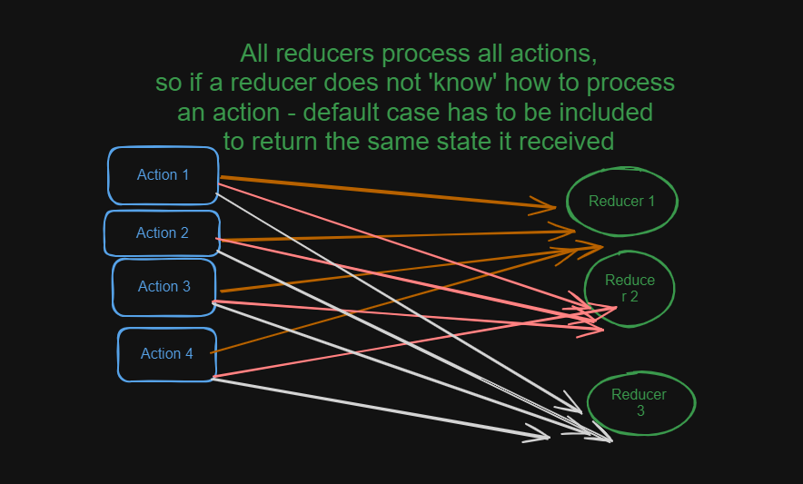

# counter-redux application 
This simple  application is designed to showcase the fundamental concepts of Redux data flow. By utilizing Redux, the project aims to provide an illustration of how data flows through the application. Update logic is immutable as tools like Immer or Redux toolkit are not used in this app. 

The Redux data flow in this application replicates an image below that illustrates the sequence of events triggered by a user interacting with the UI through actions like "deposit" or "withdraw." The process is outlined below:

🌳User Interaction: The data flow commences when a user interacts with the application's UI,  in this app - by pressing a button to deposit or withdraw funds.

🌳Action Generation: The interaction triggers the generation of an action through an event handler function. An action is essentially an object that contains metadata describing the event. For instance: {type: "deposit", payload: 10}. 

🌳Action Dispatch and State Update: The action is then dispatched to the store, store calles all reducer functions it containes. A reducer function takes the current state (located in the store of the application) and action, returning an updated state (or the same state it received if the reducer doesn't 'know' how to process an action). 

🌳Receiving Updated State: Through selector functions components "subscribe" to the store in order to receive their "slice" of the updated state. This ensures that components only access the relevant data they require. 

🌳UI Rerender: In response to the updated state, useSelector hook triggers a rerender of the UI. This ensures that the user interface accurately reflects the modified state, providing a smooth and responsive user experience.

