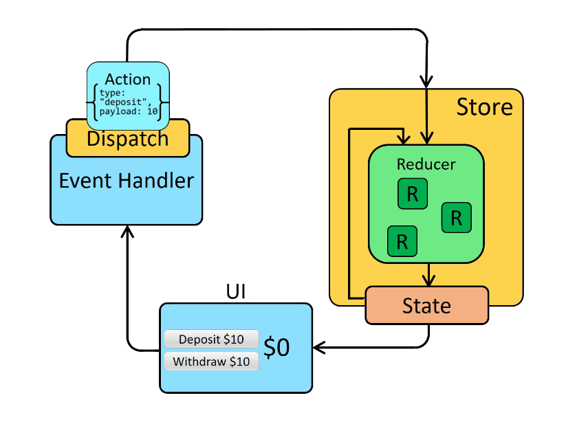

# counter-redux application 
This simple  application is designed to showcase the fundamental concepts of Redux data flow. By utilizing Redux, the project aims to provide a clear illustration of how data flows through the application. Update logic is immutable as tools like Immer or Redux toolkit are not used in this app. 

Redux Data Flow
The Redux data flow in this application closely follows a scheme that elucidates the sequence of events triggered by a user interacting with the UI through actions like "deposit" or "withdraw." The process is outlined below:

User Interaction: The data flow commences when a user interacts with the application's UI, typically by pressing a button to deposit or withdraw funds.

Action Generation: The interaction triggers the generation of an action through an event handler function. An action is essentially an object that contains metadata describing the event. For instance: {type: "deposit", payload: 10}.

Action Dispatch: The action is then dispatched to a reducer function. The reducer function takes the current state (maintained in the global store of the application) and the action type, returning an updated state.

State Update: Through selector functions, components receive a "slice" of the updated state. This ensures that components only access the relevant data they require. The global state remains immutable, adhering to best practices even without the use of tools like Immer or the Redux Toolkit.

UI Rerender: React, in response to the updated state, triggers a rerender of the UI. This seamless process ensures that the user interface accurately reflects the modified state, providing a smooth and responsive user experience.

